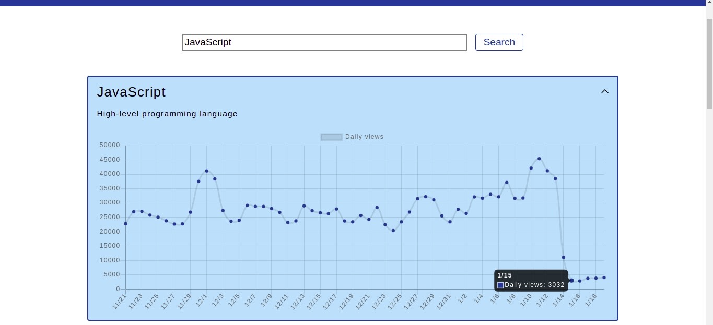

# [WikiSight](https://wiki-pageviews.vercel.app/)

WikiSight is an app that graphs the daily viewcounts of Wikipedia articles.

Users can search for a keyword. The app returns a list of related wikipedia articles. Users can click on these articles to see a graph of the viewcount over the last 60 days. The expanded view of articles also shows a brief description if one was provided by the API.

View the live project [here](https://wiki-pageviews.vercel.app/).

This project uses the public Wikipedia API. Learn more about this API [here](https://www.mediawiki.org/wiki/API:Main_page).

## Images

## Assignment

> Create a single-page webapp that pulls data from a web service (or services), renders some kind of visualization of the data (could just be text, it doesn't need to be an image or anything), and allows for at least one point of interaction with the data.

## Tech

- React.js
- Chart.js
- CSS3
